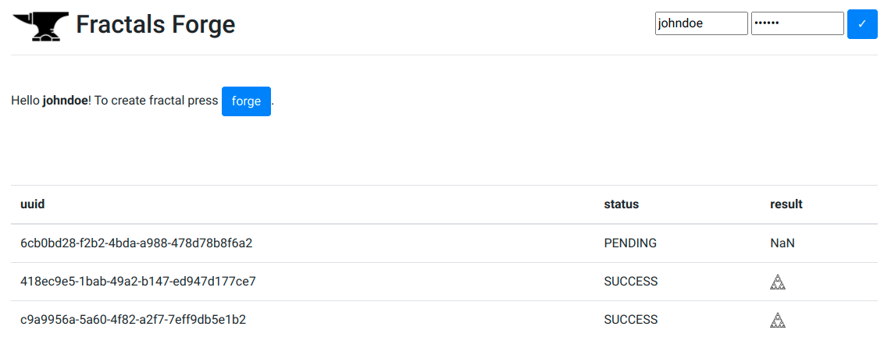

# Svarog Forges
  
##### i.e. plain-vanilla async service blueprint for compute intensive tasks

<p align="center">  </p> &nbsp;
                                   
The project's purpose was to tailor minimalistic async `Python` service template for `CPU` absorbing tasks. Here *distributed message passing* pattern is used where long computations are baked behind the curtain. The following have been accomplished until now:
 - [x] main service impl in [FastAPI](https://fastapi.tiangolo.com/) frame with all batteries included i.a. `Swagger` & `OAuth2`;
 - [x] worker realisation based on [Celery](https://docs.celeryq.dev/en/stable/) (+[Flower](https://flower.readthedocs.io/en/latest/)) and [Redis](https://redis.io/) as quee message broker;
 - [ ] some compute intensive tasks examples i.e. fractals img generation / neural nets training..;
 - [ ] backend dbase solution  ([Redis](https://redis.io/) again?) for storing serialized tasks results;
 - [x] trivial static tasks monitoring webapp tailored with pure `JS`, `Jinja` & `Html\CSS`.

##### #QUICKTOUR:
```
# service deploy & run with docker-compose:
sudo docker compose down && sudo docker compose up -V --remove-orphans
```